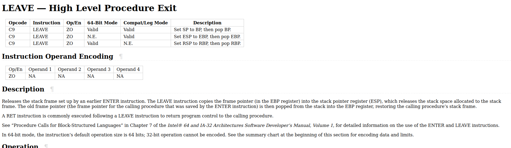

### A buffer overflow challenge with no mitigations and no shell code required

First before disassembling running the program reveals it takes an input and doesn't do much.


Opening in radare2 and analyzing the function list shows an interesting function sym.shell_land


Looking at the assembly for the sym.shell_land function reveals it opens a shell. How nice. 
Taking a quick peek into main shows it calls vacation and has a buffer of length 16. The vacation function shows what we saw in the output of the program.


Lets try and take a vacation to shell_land as it where by overflowing the buffer and rewriting the return address. It important to notice that before the function returns assembly instruction leave is called. Leave causes the rbp to be set to the rsp meaing we will need to write our return address to the top of the rsp not the rbp. Using pwntools cyclic tool and pwndbg we find the offset for the rsp to be 24. We get the address to return too from the function list analysis from before. Running checksec there are no security mechanisms set besides nx so we are good to type up a quick script and get on our flight to shell_land.

```
from pwn import *

context.binary = "./chall"
p = remote('tjc.tf', 31680)
junk = B"A"*24
retn = p64(0x40119b)
garbage = B"A"*8
p.recvline()
p.sendline(junk + retn + garbage)
p.interactive()
```
Running our wonder pwntools script we get a shell and can read the flag.txt file


Incase you were totally unfamiliar with the leave instruction or weren't sure why your shell wasn't poping on a machine I added the image below.


