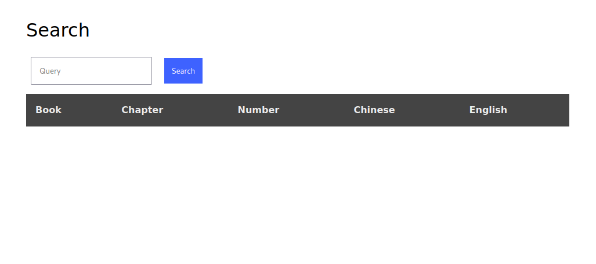
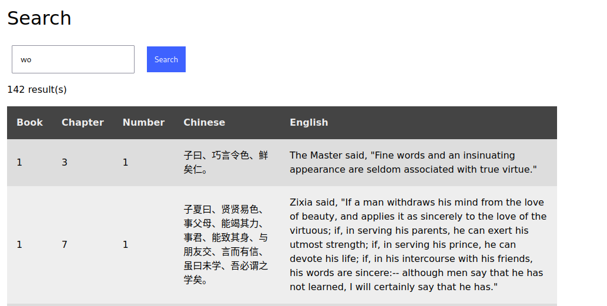
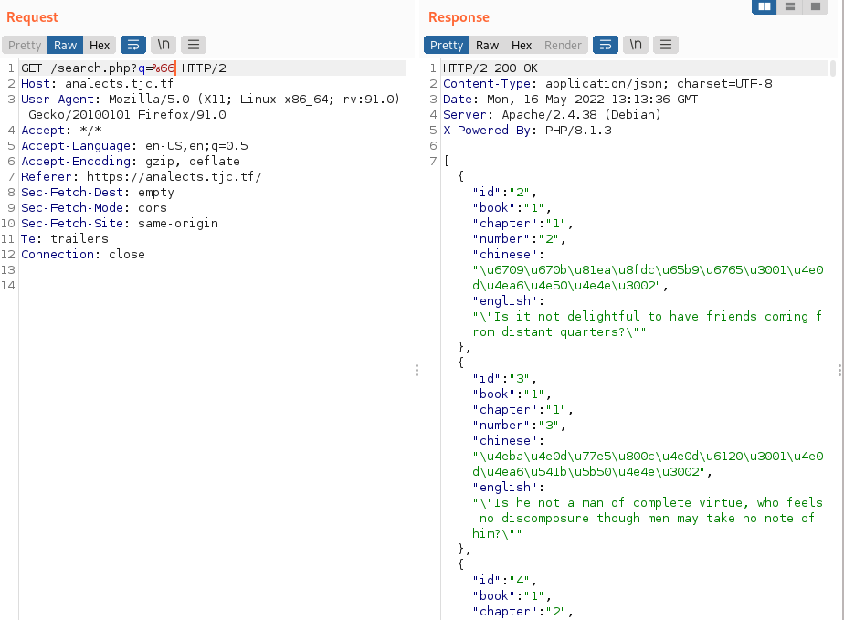
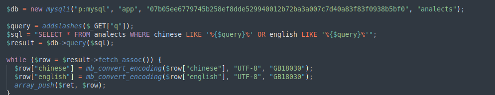
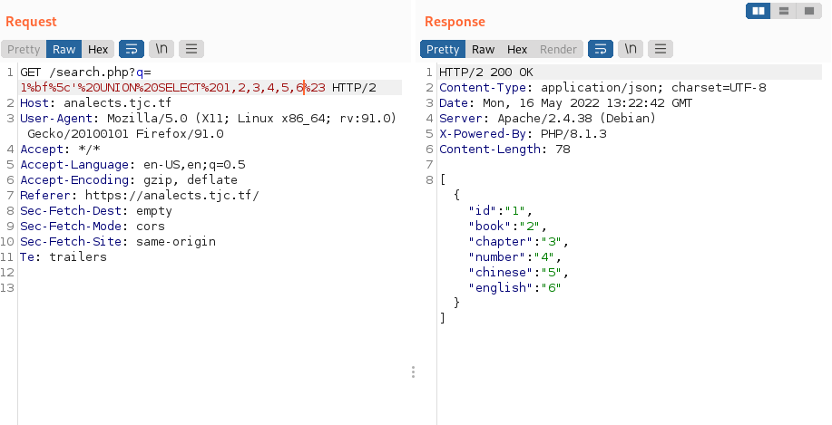
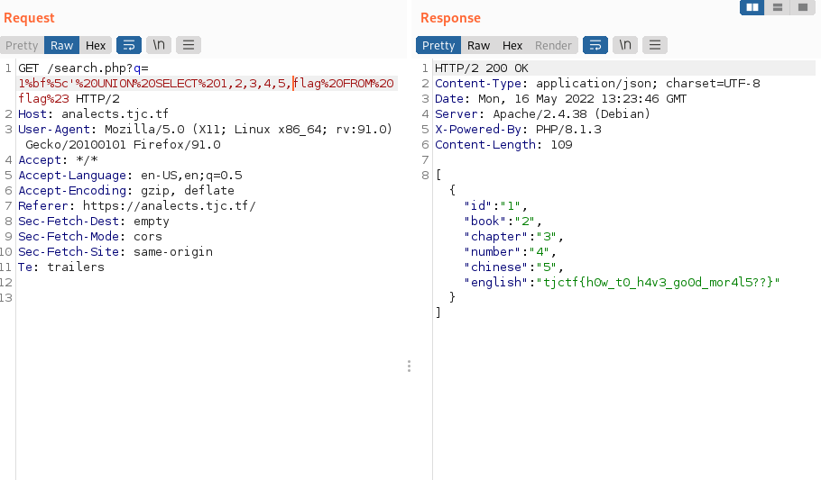

### Analects is a php based webpage that has a mysql database storing confucius quotes in english and chinese.
Looking at the webpage there is a box to enter a query.

Sending a query we get

Lets open burpsuite and send the request to repeater so we can test easier

Checking the source code we see the value of the q parameter is being passed to addslashes() then passed to the sql server

I have  a vauge memory of addslashes having a bypass to have sql not interpret a quote as escaped so I check my notes. 
The vulnerability works by passing what sql will interpret as a multibyte chinese character. %5C is \ so our input of %27 (') will become %27 will become %5C%27 (\') in the sql query. If we change our query to %bf%27 it will become %bf%5c%27 which will be interpreted by sql as (chinese multibyte character)%27 allowing us to do a union based sql injection. We saw earlier the table we are querying is 6 colums wide so we will use %bf%27%20UNION%20SELECT%201,2,3,4,5,6%23 as our query. %23 is # which is a valid inline comment in mysql. We get this in response.

## BEAUTIFUL
Now all we need to do is look at the source code for the sql database, we see there is a table flag with an entry flag so lets change our query to get that.

And there we go flag retrieved. Just to go a little more into the addslashes vulnerability. It occurs because addslashes does not consider the character sets that are used by the backend. Only certain character sets are vulnerabile to this sort of attack. I didn't mention the vulnerable char sets in the writeup because I remebered researching addslashes bypasses for another ctf and something clicked in my mind.
