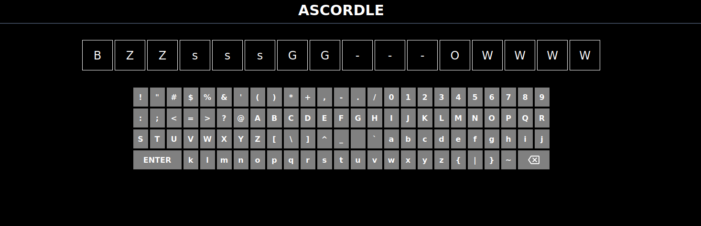
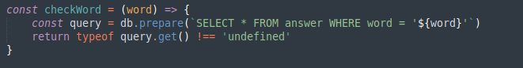
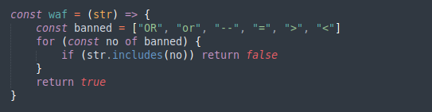

### Ascordle is a full keyboard single guess 16 word length version of wordle

Jumping in we see exactly what is advertisted knock off impossible wordle

Jumping right into the source code analysis there are two things that stick out like sore thumb.

This is simply bad node code that is a totally insecure way to make an sql query. The developer also made a little input validation so it isn't just an instant win.

