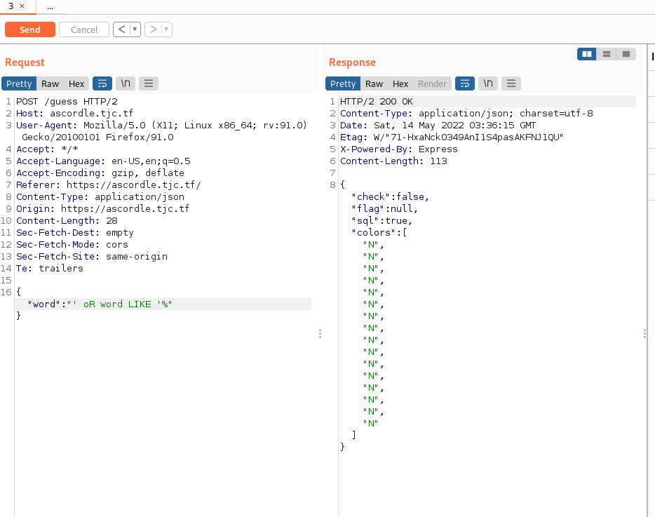
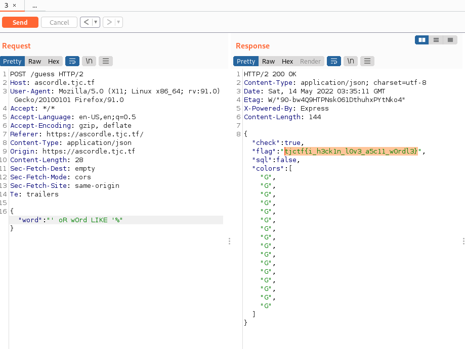
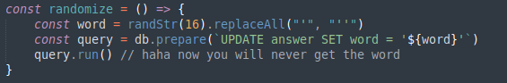

### Ascordle is a full keyboard single guess 16 word length version of wordle

Jumping in we see exactly what is advertisted knock off impossible wordle

Jumping right into the source code analysis there are two things that stick out like sore thumb.

This is simply bad node code that is a totally insecure way to make an sql query. The developer also made a little input validation so it isn't just an instant win.

This validation does not account for the scenario of Or / oR as sql does not care about the case of letters used. 
Payload I formulated in my head was ' oR word LIKE '%. Though it was longer then 16 chars there was no validation for length of input so I figured it would be fine.

## HUH?

I thought I must have missed the length validation. Reviewing the source code again I didn't see it. Then it hit me word contains 'or'. One big facepalm later I fixed the query changing it to ' oR wOrd LIKE '% which got the flag.

## WONDERFUL 

One funny thing I noticed on my review of the source code is that the code accounts for it's own vulnerability in the answer generation. Obviously the developer of the challenge couldn't just have it throw a sql error sometimes. Still I found it a little funny.

