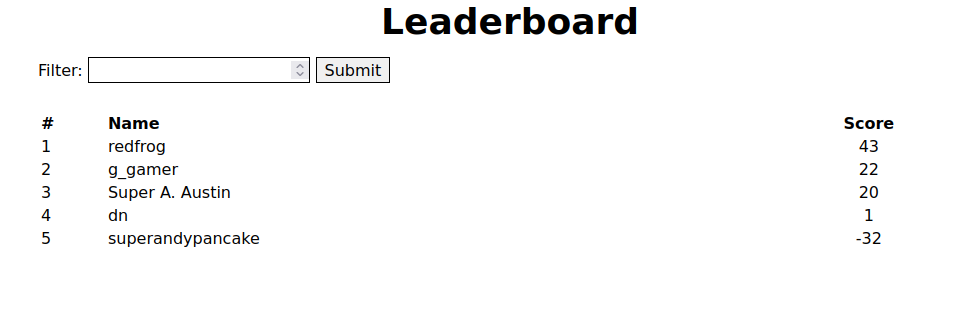
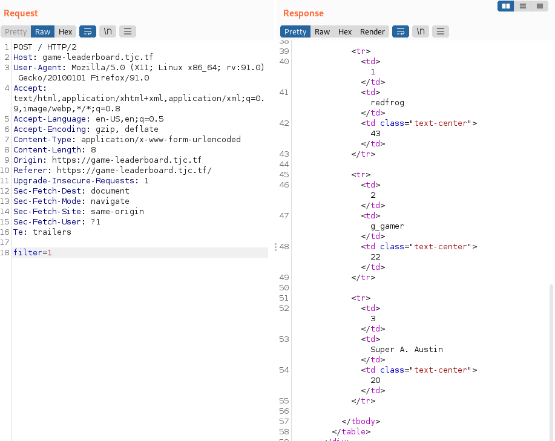
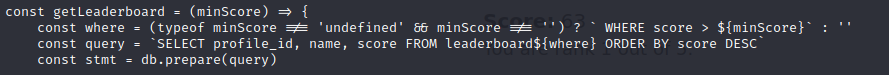
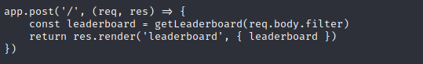
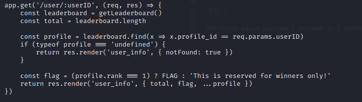
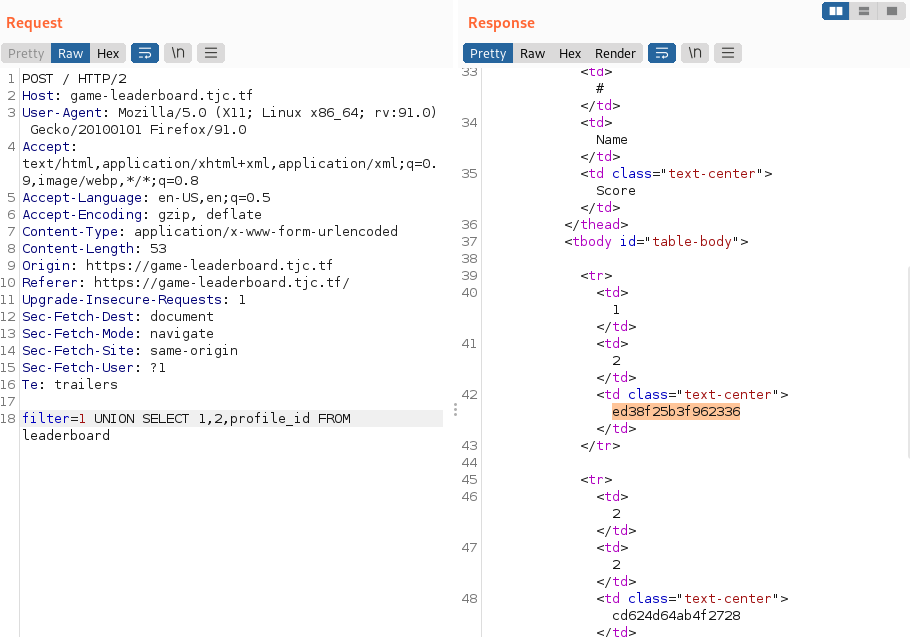
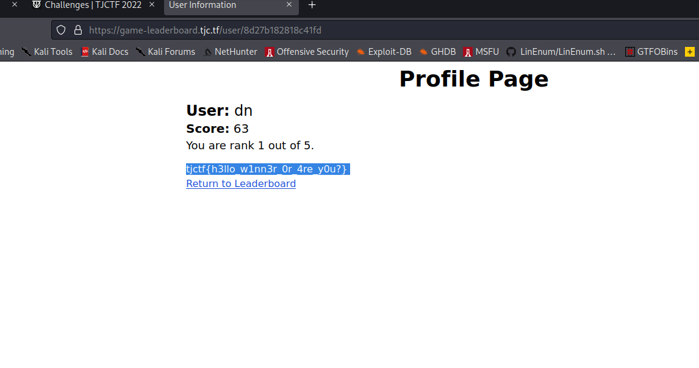

### Game-leaderboard no logins or anything. Allows you to make queries to the database. Get profile_id through sqli -> idor for flag

This one is real quick. We are presented with a simple leaderboard that has a form to make a query.

Lets send a query & catch it in burp

Checking the source code we see a few points that stick out.

100% sqli vulnerable code. !note no quotes are used so putting ' will cause a 500 error

When we are making a post request to page it calls the sqli vulnerable function passing our the filter value in our request's body. 

This is the last piece we need. An idor that will allow us to get the flag if we know the profile_id of the person with the most points.
The union based payload I decieded to use to get the profile_ids is 1 UNION SELECT 1,2,profile_id FROM leaderboard

### HURRAY!!

Then requesting the first userid on the /user endpoint gives us the flag

#### NOTE
The screenshot of the solve page with the flag doesn't match with some of the other screenshots because I didn't take enough screenshots when I was actually solving the challenge because of the brevity of it. 
